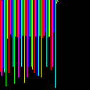

> Somebody leAked TrumP's favorite colors, looks like they used a really
> esoteric format. Some chiNese hacker named "DanGer Mouse" provided us the
> leak, getting this crucial info could really sway voters at the polls!

The following image was provided for this challenge:


For this challenge, there were quite a few clues in the description. 

- The odd capitalisation of certain letters was the first - the letters APNG
  were capitalised when they didn't need to be. This hinted that the image
  was in fact an APNG - opening it in Firefox showed the animated nature of the
  image - confirming that it was an APNG.
- "esoteric format" hinted that perhaps an esolang was involved.
- "Danger Mouse" is the author of the esolang Piet.

After realising the image was a Piet program, I downloaded npiet and executed
the program, the output was:

```
#ff0000
```

I realised that each frame in the APNG was likely to be a different Piet
program. With this in mind, I tried some online APNG splitters, but eventually
settled on using GIMP.

I installed an [APNG plugin](http://registry.gimp.org/node/24394) and opened
the image. After waiting for all 16384 frames to be converted into layers, I
looked for a way of exporting each layer as a separate PNG. I eventually
settled on [Export Layers](http://registry.gimp.org/node/28268). Unfortunately,
exporting as a PNG wasn't working so I exported each layer as a TGA file and
converted to a PNG later.

After exporting all of the layers as individual images, I tried to use npiet to
execute one. This didn't work, as the layers were just deltas, rather than
complete images. To solve this, I edited the original PNG into a base image and
composed the layers on top of it using ImageMagick (I also converted the
background of the layers from white to black, although I am not sure if this
was necessary).


I wrote the following script to convert, compose and execute each layer:

```shell
#!/bin/bash
for f in *.tga
do
    fpng="$(basename "$f" .tga).png"
    echo -n "$fpng : "
    convert -fuzz 5% "${f}" -fill black -opaque white "${f}"
    convert base.png "${f}" -compose lighten -composite "${fpng}"
    npiet "${fpng}"
    echo
done
```

I executed the script in the following manner:

```
./process.sh | sort -V | sed 's/^[^#]*#//' > out.txt
```

I then had a file that contained hex colour codes. The next step was to write a
Python script to convert the text file into a complete image.

```python
#!/usr/bin/env python3
import struct
from PIL import Image

output = Image.new('RGB', (128, 128))
colours = []

with open('out.txt', 'r') as f:
    for colour in f.readlines():
        colours.append(struct.unpack('BBB', bytes.fromhex(colour.strip())))

output.putdata(colours)
output.save('out.png', 'PNG')
```

The generated image looked promising, but running npiet on it didn't yield a
flag. 



On closer inspection, the darker coloured blocks linking up the columns were
missing. The curve on the right hand side of the image was also incomplete.
After fixing the issues, I was left with the following image:


Running npiet on this image and entering a random string resulted in the
following output:

```
fag{7h15_w45n7_3v3n_4_ch4ll3n63._54d_.}
```

After adding the missing "l" into the word "flag", putting the flag into the
site yielded 250 points for the team.
